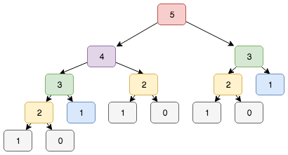

# 05: Cache

Create a copy of your program from the `04-instrumentation/` directory
and save it in this direcory.

Below is a callgraph for the function calls that result from `fib(5);`.

The callgraph for `fib(3)` contains 5 function calls.
The callgraph for `fib(4)` contains 9 function calls.
The callgraph for `fib(5)` contains 15 function calls.

The number of function calls grows exponentially due to the large amount
of duplicate work. For example, in the above graph we can see that to compute
`fib(5)` we do the work of `fib(3)` twice.

Growing further:
* `fib(10)` would need 177 calls.
* `fib(11)` would need 287 calls.
* `fib(12)` would need 465 calls.
* `fib(13)` would need 753 calls.
* `fib(14)` would need 1219 calls.
* ..
* `fib(20)` would need 21,891 calls.

We can avoid computing the same thing twice by storing the result when
we compute it and re-using it next time. This remembering and re-using of
past results is called "caching".

Try this in your program by changing your `function fib` to store its results
in an object from the main scope, and to consult this object within `fib`
before computing anything else.

Expected outcome:

<pre>
05-cache/$ node main.js 10
10 = 55

Total: 19 function calls!
</pre>

<pre>
05-cache/$ node main.js 20
10 = 6765

Total: 39 function calls!
</pre>
